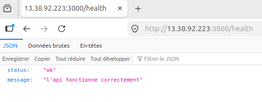

# TP CI/CD

Dans le cadre du cours EFREI M2 CI/CD : TP déploiement

## Résultats

Résultat : http://13.38.92.223:3000/health

## Pipeline

fonctionnement du pipeline :

### 1. lancement des tests unitaires

- récupération du code source
- mise en place de python 3.12
- installation des dépendances
- lancement des tests avec `unittest`

### 2. lancement des tests E2E (End to end)

- récupération du code source
- mise en place de python 3.12
- installation des dépendances (requests)
- build de l'image Docker
- lancement de l'API grâce à l'image Docker
- lancement des tests E2E avec `unittest`

### 3. build de l'image et push

- login vers le docker hub
- mise en place de Docker buildx
- build et push de l'image

### 4. Déploiement

- mise en place de SSH : clef privée et `known_hosts`
- lancement de la commande SSH sur l'instance EC2 AWS :
  - arrêt du conteneur
  - suppression du conteneur
  - récupération de l'image à jour
  - lancement du conteneur

### 5. Healthcheck sur l'application déployée

- lancement de `curl` sur l'endpoint de healthcheck, sur l'instance EC2.
